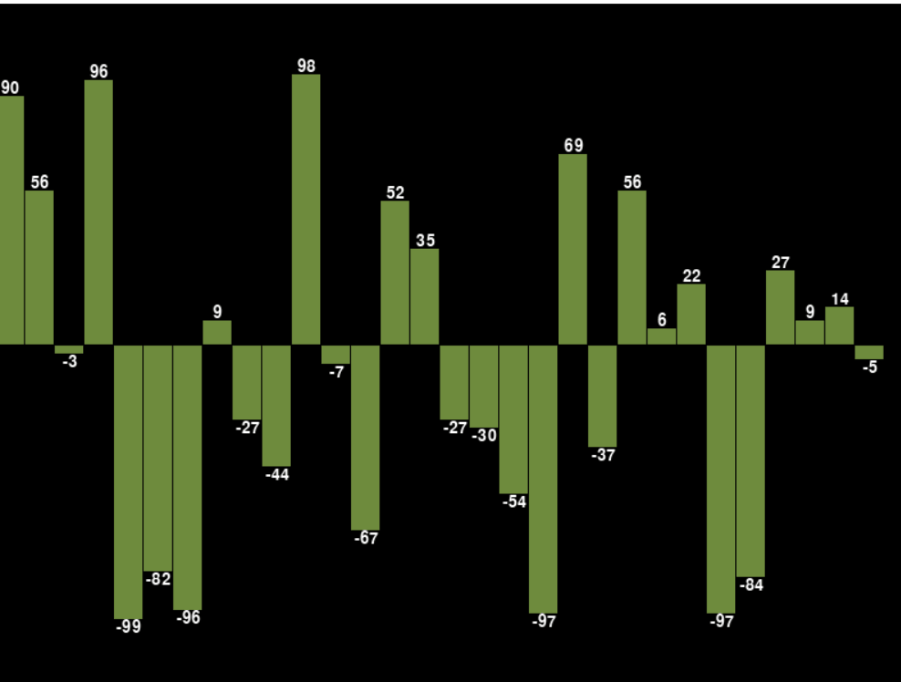

## Visualizing Sorting Algorithms

### Features:
- Supports negative numbers
- `Red` bar indicates there is swapping taking place
- `Orange` bar indicates smaller pointer
- `Gold` bar indicates larger pointer
- For Quick Sort, `Blue` bar indicates the Pivot

### Implemented for following sorting algorithms:
1. Insertion Sort
2. Bubble Sort
3. Quick Sort

### Requirements:
- Python 3.9 or above
- [pygame](pygame.org)

### Installation:
```bash
git clone <repository_url>.git
pip install -r requirements.txt
python3 ./main.py
```

### Usage:
- Use `WASD` or `arrow` keys to move around
- Use `Q`, `E` or `mouse scroll` to zoom in/out (Not perfect)
- Press `Enter` to start the sorting
- Increase `delay_seconds` in the code to reduce the sorting speed. (Recommended value = 0.2 seconds)
- Set `delay_seconds` to 0, if you want to pan/zoom around the screen.

**NOTE:** Avoid changing the FPS. Changing it might result in unexpected behavior.

### Todo List:
- How to deal when the array size is so large that it can't fit in the screen
    - Reduce the array such that it autofits to the screen
    - Autofit to the screen while zooming in/out

### Bubble Sort


### Insertion Sort


### Quick Sort
